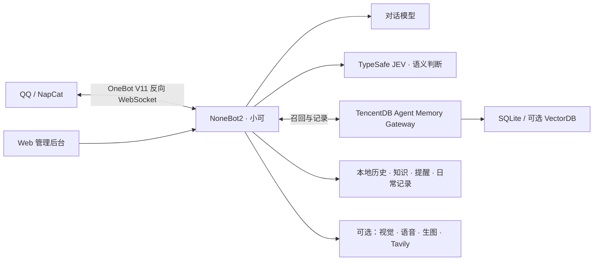

# Xiaoke-qqbot · 小可 QQ 群聊机器人

一个可以自部署的 QQ AI 伙伴：接住群聊里的话题，记住已经确认的事情，也知道什么时候该简短回答、什么时候该安静。

基于 **NapCat + NoneBot2 / OneBot V11**，使用兼容 Chat Completions 的对话模型。通过 **TypeSafe JEV** 做语义决策，通过 **TencentDB Agent Memory** 管理长期记忆，配有可配置模型、行为和运行记录的 Web 后台。

## 核心功能

| 能力 | 群里的体验 |
| --- | --- |
| 语义参与与自然回复 | 判断有没有人在叫自己、插话是否合适；区分玩笑、安慰和认真求助；短句说完就收口 |
| 记忆、知识与纠错 | 保存明确的长期偏好和群内已确认的解决方案，引用来源；理解“刚才是开玩笑，别记住” |
| 事项与提醒 | 跟踪未解决的问题，在相关话题里自然追问；支持“明早九点提醒我更新证书” |
| 多模态聊天 | 将聊天图片直接放入模型上下文；也可使用独立识图模型 |
| QQ 语音 | 将回复生成语音；由 JEV 判断是否适合发语音、采用甜美、温柔或认真等表达风格 |
| 校园日常 | 每日变化的大学生日程、睡觉静默、记录理由的强制起床、到点补充日常细节 |
| 日常配图 | 根据已记录事件生成第一人称校园 AI 配图；重复问同一件事时沿用细节和原图 |
| 搜索与表达节奏 | Tavily 联网检索并附来源；按字数控制分段间隔，轻松闲聊可低频模拟手误 |
| 管理与诊断 | 群白名单、权限、成员互动画像、聊天总结、可选入群审核与 Webhook；统一模型请求和 JEV 记录 |

后台默认浅色，支持深色主题；记忆、事项、提醒、知识和偏好采用分类标签页与表格查看。大多数扩展功能默认关闭，可按需启用。

这些能力模拟的是 AI 角色的生活与表达。校园图片为 AI 生成，机器人被问到身份或图片来源时应如实说明。

[核心功能与实现](docs/CORE_FEATURES.md) · [配置指南](docs/CONFIGURATION.md) · [开源提交检查](docs/OPEN_SOURCE.md)

## 架构



`run.py` 负责加载环境、按需启动官方记忆网关并运行机器人。前端为原生 HTML / CSS / JavaScript，不需要单独构建；Node.js 用于记忆服务。

## 快速开始

### 1. 准备环境

- Python **3.10+**，推荐 3.12。
- Node.js **22.16.0+** 与 npm，用于 TencentDB Agent Memory。
- 单独安装并登录 [NapCat](https://github.com/NapNeko/NapCatQQ)，启用 OneBot V11。
- 一个可用的 Chat Completions 模型接口和 API Key。
- 可选：TypeSafe JEV、视觉、语音、生图及 Tavily 的服务权限。

项目不包含 QQ / NapCat 程序、账号登录状态或任何服务密钥。QQ 协议连接及媒体发送能力取决于所用 NapCat / QQ 版本。

### 2. 安装依赖

获取源码并进入项目目录：

```bash
git clone https://github.com/Tokeii0/Xiaoke-qqbot.git
cd Xiaoke-qqbot
```

Windows PowerShell：

```powershell
py -3.12 -m venv .venv
.\.venv\Scripts\python.exe -m pip install --upgrade pip
.\.venv\Scripts\python.exe -m pip install -e .
npm ci
Copy-Item .env.example .env
Copy-Item tdai-gateway.example.json tdai-gateway.json
```

Linux / macOS：

```bash
python3 -m venv .venv
source .venv/bin/activate
python -m pip install --upgrade pip
python -m pip install -e .
npm ci
cp .env.example .env
cp tdai-gateway.example.json tdai-gateway.json
```

复制配置仅用于首次安装；更新已有实例时保留原配置和 `data/`。本地验证环境为 Windows、Python 3.12 和 Node.js 24；其他环境可参考仓库中的 CI 检查流程。

### 3. 填写 `.env`

| 配置 | 填什么 |
| --- | --- |
| `BOT_API_BASE_URL`、`BOT_API_KEY`、`BOT_MODEL` | 对话服务的基础地址、密钥和实际可用的模型名 |
| `SUPERUSERS` | NoneBot 超管 QQ，使用 JSON 数组，例如 `["10001"]`，请替换为自己的号码 |
| `BOT_SUPERUSERS` | 同一组超管 QQ，多个号码用逗号分隔 |
| `BOT_ALLOWED_GROUPS` | 允许机器人工作的群号，多个号码用逗号分隔；空值不放行任何群 |
| `ONEBOT_ACCESS_TOKEN` | 与 NapCat 反向 WebSocket 使用相同的随机令牌 |
| `WEB_ADMIN_TOKEN` | 独立的后台管理令牌；不填写则不启用后台 |
| `TDAI_GATEWAY_API_KEY` | 独立的记忆网关令牌，由机器人与网关共用 |

可在已激活的虚拟环境中运行以下命令生成一个令牌；为上述三个用途分别生成：

```bash
python -c "import secrets; print(secrets.token_urlsafe(32))"
```

示例中的密钥均为空，群和超管也为空。不要直接使用文档里的演示号码。

### 4. 连接 NapCat 并启动

在 NapCat 的 OneBot V11 配置中添加反向 WebSocket 客户端，填写：

```text
URL: ws://127.0.0.1:8080/onebot/v11/ws
Token: 与 .env 中 ONEBOT_ACCESS_TOKEN 一致
```

在项目目录运行：

```powershell
# Windows
.\.venv\Scripts\python.exe bot.py
```

```bash
# Linux / macOS，先激活虚拟环境
python bot.py
```

默认先检查 `http://127.0.0.1:8420/health`，需要时自动启动记忆网关，然后启动机器人。已有独立网关时可设置 `MEMORY_AUTO_START=false`，并填写其地址和令牌。

### 5. 打开后台

访问 [http://127.0.0.1:8080/admin](http://127.0.0.1:8080/admin)，使用 `WEB_ADMIN_TOKEN` 登录。先检查机器人连接、对话模型和允许的群，再在测试群发送“小可，你好”。

要启用语义判断，在 `.env` 设置 `TYPESAFE_API_KEY` 后重启，再在后台开启 JEV 总开关及需要的子功能。模型、人设和多数行为设置可在后台保存后立即生效；监听地址、启动令牌和记忆网关配置需要重启。

## 常用命令

| 命令 | 权限 / 用途 |
| --- | --- |
| `/小可 帮助` | 查看帮助 |
| `/小可 状态` | 群管理或超管查看运行状态 |
| `/小可 开启`、`/小可 关闭` | 群管理或超管控制当前群的聊天开关 |
| `/小可 记忆 关键词` | 仅超管私聊可用，检索共享记忆网关；群内不会返回这类全局结果 |

也支持 `/bot` 前缀。聊天默认通过 @、机器人名称或配置的关键词触发；普通私聊不开放，超管私聊聊天也需要单独开启。

启用相应 JEV 子功能后，还可以自然地说：“查看我的提醒”“取消提醒 12”“整理今天未解决的问题”“以后代码问题用文字回答”。提醒目前仅支持明确时间的一次性任务。

## 使用边界

- JEV、搜索、语音和生图可能产生独立费用；阈值、概率、冷却和主动消息预算共同影响实际触发。一条回复可能包含多次模型请求。
- 模型名称是配置项。当前语音客户端使用 `/live/sessions` WebSocket 协议，生图使用 `/images/generations`；不能只替换模型名就假定协议兼容。具体接口与降级行为见[配置指南](docs/CONFIGURATION.md)。
- 联网由 Tavily 提供。把对话模型切到 DeepSeek，不会自动获得联网能力。
- 本地聊天、记忆、成员画像和请求日志可能含隐私。运行数据与源码分开保存，发布前阅读 [SECURITY.md](SECURITY.md)。

## 开发与许可

```bash
python -m unittest discover -s tests
node --check xiaoke_bot/web/app.js
```

测试主要使用模拟接口和临时数据，不需要连接真实 QQ 或付费模型。贡献方式见 [CONTRIBUTING.md](CONTRIBUTING.md)。

项目代码采用 [MIT License](LICENSE)。依赖和外部服务遵循各自许可证与使用条款；本项目的 MIT 不覆盖 QQ / NapCat 的分发包、模型服务或用户聊天数据。依赖说明见[开源提交检查](docs/OPEN_SOURCE.md#依赖与授权)。
